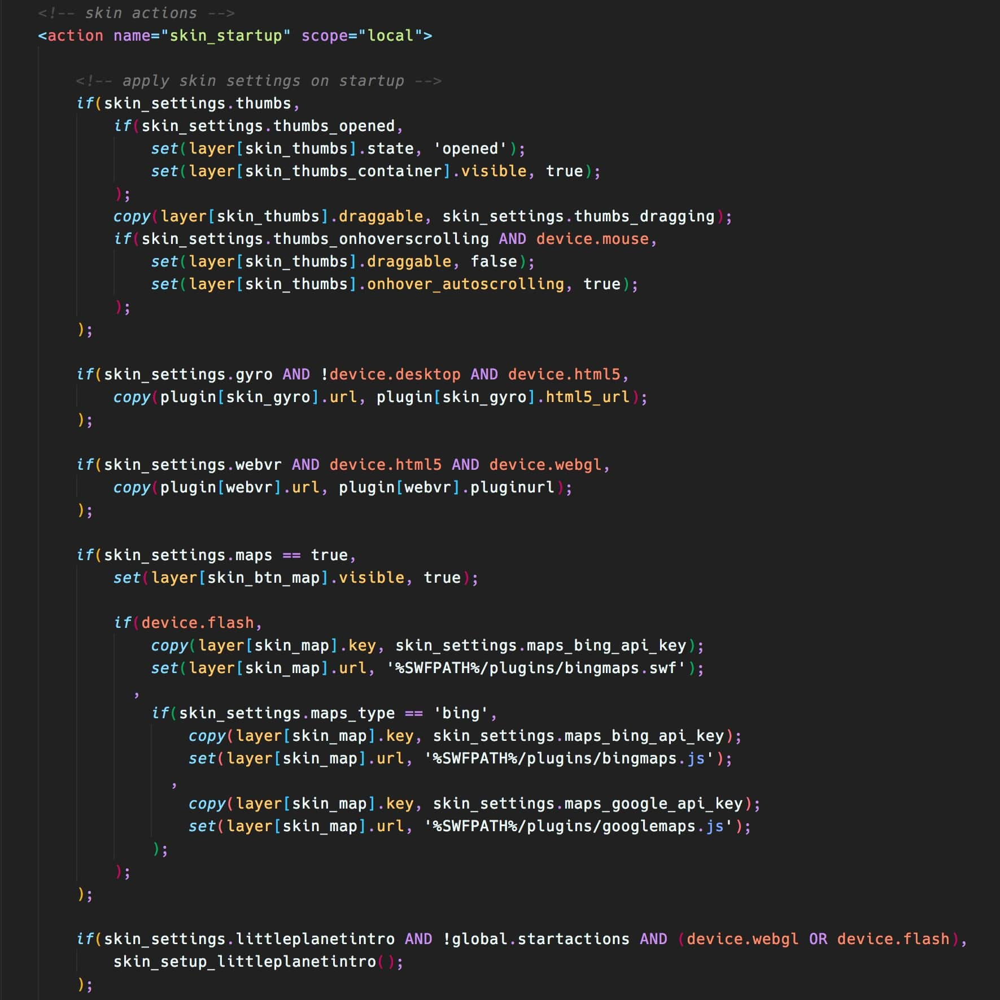

# Krpano Markup Language for Visual Studo Code

This extension add support to write XML files for [Krpano](https://krpano.com/), a small and very flexible high-performance viewer for all kind of panoramic images and interactive virtual tours.

## Features

At the momment it only features syntax highlighting.



## Installation

1. Navigate to the VS Code extensions folder.

Windows: %USERPROFILE%\.vscode\extensions
macOS/Linux: $HOME/.vscode/extensions

2. Clone this project

``git clone https://github.com/rafaelgpaz/krpano-markup-language.git``

3. In VS Code open the user settings.

4. Add the following line:

```json
    "files.associations": {
        "*.xml": "krpano"
    }

```

## ToDo

- Indentation rules
- Snippets
- Intellisense
- Hovers
- Validators

## Contribute

Please contribute to make this extension grow and help other developers to create fantastic 360 virtual tours with Krpano.
Fork this project, report any issues or send your comments and suggestions.